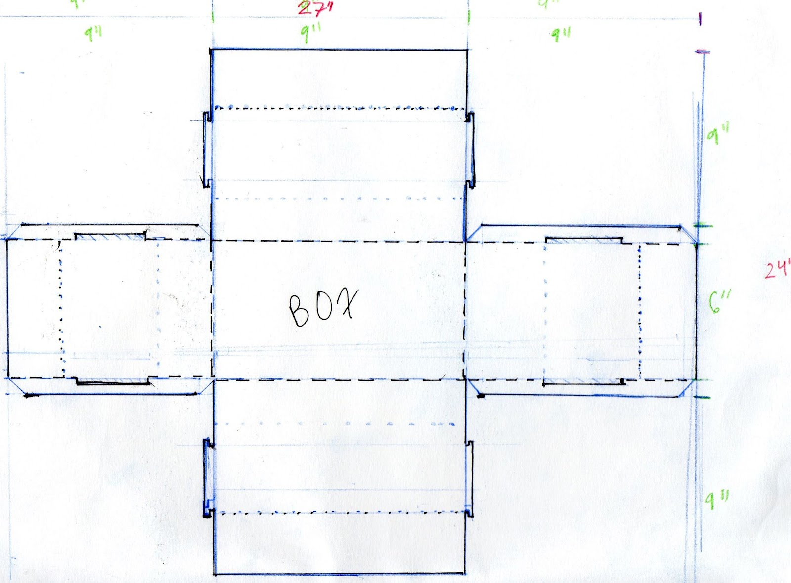

&nbsp;

# _The Perfect Plane_

&nbsp;
&nbsp;

&nbsp;

To give instruction on how to create a world-record holding paper plane I created an instructional poster highlighting the steps to create a finished product.

&nbsp;
&nbsp;
&nbsp;

&nbsp;

# _Hacking a Box_

&nbsp;
&nbsp;

&nbsp;

&nbsp;

&nbsp;

&nbsp;

The idea behind this project was to "hack" the conventional idea of a box. The goal was to create a box that has the basic function of holding items, while also being a planter for seedlings. The box has paper cylinders that can grow seeds until you transfer them to a different pot.

&nbsp;
&nbsp;
&nbsp;

&nbsp;

# _Designing a Shelter_

&nbsp;
&nbsp;

&nbsp;

These are some of the final sketches I created for a small shelter meant for the winter climate.The project highlights the involvement of the community in building them for the less fortunate, so breaking the shelter into sections allows for work to be divided easily.

&nbsp;
&nbsp;
&nbsp;